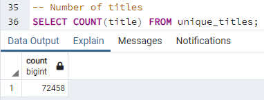
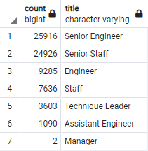
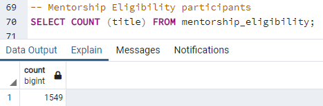
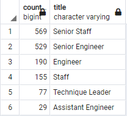
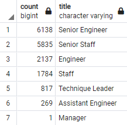
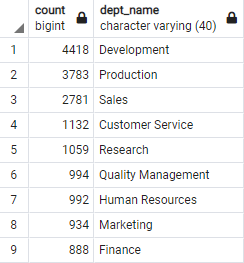
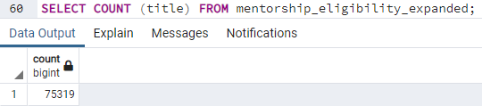
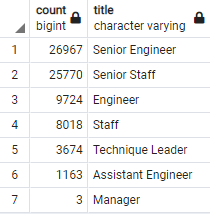
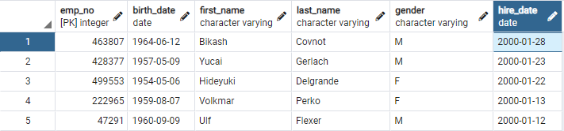

# Pewlett Hackard Analysis

## Overview of the analysis

### Tasks
This analysis provides answers for two main tasks:
- Determine the number of retiring employees per title,
- Identify employees who are eligible to participate in a mentorship program.

### Purpose of using SQL
Since there are several thousands of employees in the company, the employee data is huge. Pewlett Hackard has been mainly using Excel and VBA to work with their data so the original data for the analysis is only available in the form of several CSV files. SQL has been used for the analysis purposes because of the amount of original data, and to be able to link files between each other to retrieve and collect specific information for next steps of the analysis.

### Purpose of the analysis
The analysis will help Pewlett Hackard to prepare for the upcoming employees' retirements in the near future and to avoid the mess with huge number of open vacancies.

## Results

### Deliverable 1 overview

Retiring Titles file was created to determine the number of retiring employees per title. Unique Titles file contains detailed information: employee number, first and last name and title. Both tables filtered by only current employees with the most recent title who were born between 1952 and 1955.

Unique Titles file was created by joining specific columns from original CSVs: Employees and Titles. Below code was used to filter by employees who were born between 1952 and 1955:
```
WHERE (e.birth_date BETWEEN '1952-01-01' AND '1955-12-31')
```
Below code was used to filter only current employees:
```
WHERE to_date = '9999-01-01'
```
Since there were employees who have multiple titles in the database (e.g., due to promotions) below code was used to get the most recent titles:
```
SELECT DISTINCT ON (emp_no) emp_no,
...
ORDER BY emp_no, to_date DESC;
```
From the PostgreSQL Documentation regarding `DISTINCT ON()`:
```
SELECT DISTINCT ON (expression [, ...]) keeps only the first row of each set of rows where the given expressions evaluate to equal.
Note that the "first row" of each set is unpredictable unless ORDER BY is used to ensure that the desired row appears first.
```
So when applying `DISTINCT ON()` to a emp_no column with `ORDER BY` column `to_date DESC` we can be sure that we get employees with their most recent titles.

Retiring Titles table was created by using data from Unique Titles. Counting titles and creating its result in as a new column with a "count" name gives an ability to see in an output both - number of titles and their names:
```
SELECT COUNT(title) AS "count", title
```
Grouping by tile column shows the total number of employees with a split per their titles. And the result is sorted in a descending order:
```
GROUP BY title
ORDER BY count DESC;
```

### Deliverable 2 overview

Mentorship Eligibility file was filtered by only current employees with the most recent title who were born in 1965 (the youngest employees in the company). This file was created by joining specific columns from original CSVs: Employees, Department Employees and Titles. Data was filtered using `WHERE` with conditions, and `DISTINCT ON()` is showing employees with their most recent title:
```
SELECT DISTINCT ON (e.emp_no) e.emp_no,
...
WHERE (de.to_date = '9999-01-01')
	AND (e.birth_date BETWEEN '1965-01-01' AND '1965-12-31')
ORDER BY emp_no, t.to_date DESC;
```

### Major points

Find below the results of the analysis of received data:
- There are total of 72'458 retirement-age employees;

     

- The split of retirement-age employees per titles is on below screenshot:

        

- There are only 1'549 employees who are eligible to participate in a mentorship program. This is absolutely not enough to cover all vacancies in the nearest future. 

     

- On the below screenshot mentorship program participants are shown with a split per titles:

    

## Summary
As many current employees reach retirement age the summary below helps to prepare for the upcoming "silver tsunami".

***- How many roles will need to be filled as the "silver tsunami" begins to make an impact?***

Previously we saw that there are total of 72'458 retirement-age employees. Those are employees who were born between 1952 and 1955.
    
The most impact will bring employees who were born in 1952, the oldest in the company, since they will be the first to retire. Total number of those employees is 16'981 (23.4% from total retirement-age employees). In the retirement_1952.csv there is detailed information for all of them.

Below we can see a split of those employees by title:



It is also important to know which departments will be impacted:



Using the same method to analyze each year of employees' birth from 1952 to 1955 we will see that there is almost an equal percentage (~25%) of total numbers of employees ready for retirement per year from total of 72'458 retirement-age employees. So, HR team should be ready with mentorship program implementation and/or new hire process.

***- Are there enough qualified, retirement-ready employees in the departments to mentor the next generation of Pewlett Hackard employees?***

There are 1'549 employees who are eligible to participate in a mentorship program - those who were born in 1965. This means that there are more than enough qualified, retirement-ready employees to mentor the youngest employees. But on the other hand, it is dangerous that number of mentorship program participants is so low and it will be not enough to close all vacancies in the nearest future. 

If we expand mentorship program to all employees who were born between 1961 and 1965 (and not only for 1965) it will give us total of 75'319 eligible employees.



This covers vacancies in the nearest future if we are talking about all employees who were born between 1952 and 1955. The split by title of expanded mentorship program list is also on the same level as the split for retirement-age employees:

| *Expanded Mentorship Program by Title:* | *Retirement-age Employees by Title:* |
| --------------------------------------- | ------------------------------------ |
|  |  |


Also if checking original Employees file we can see that the last employee was hired in 2000. HR should start hiring process on a regular basis to make sure that the company gets also young employees to pass experience from more knowledgeable colleagues to new hired ones:

